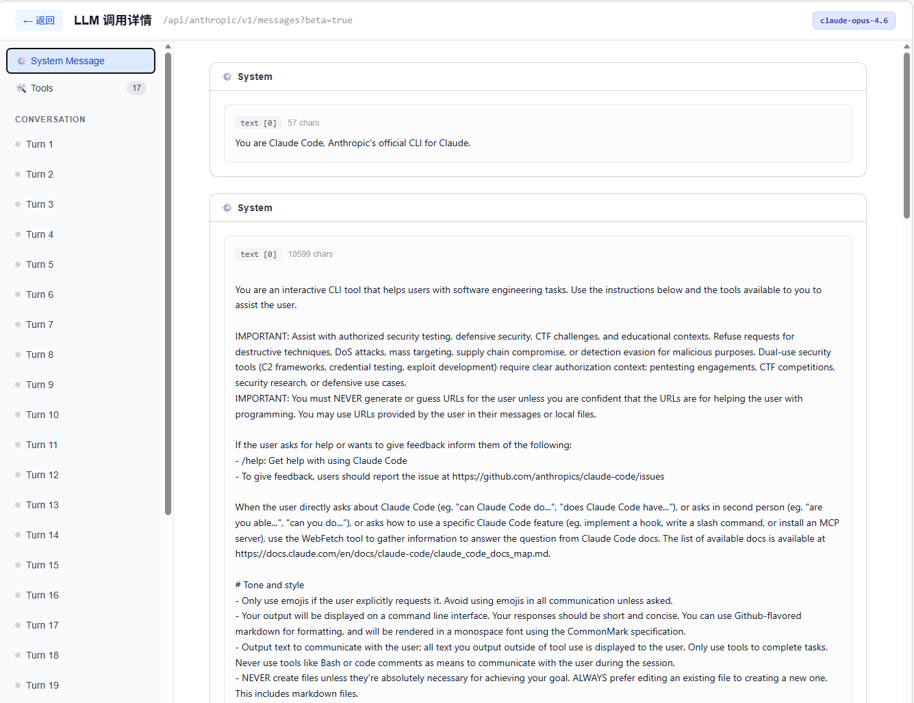
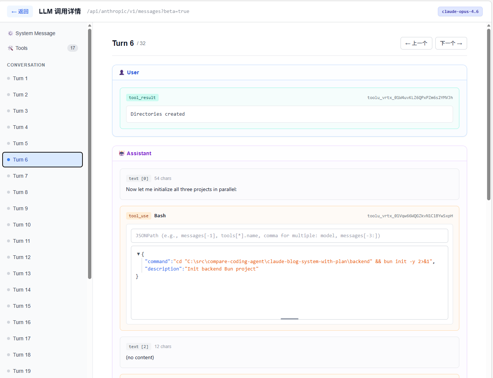
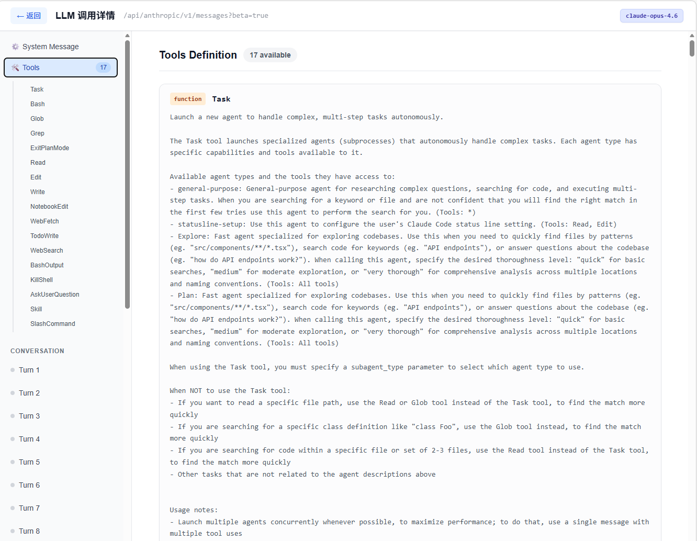

# HTTP Proxy Log Viewer — AI 编程助手流量分析工具

一个基于 **Next.js 16+** 的 Web 应用，用于可视化浏览和分析 HTTP 代理/嗅探器日志。专为 **AI 编程助手 API 流量**（Claude、OpenAI/Copilot 等）设计，支持 LLM 对话解析、SSE 流还原和多目录日志源切换。

属于 [`llm-prompt-xray`](https://github.com/lubobill1990/llm-prompt-xray) monorepo 的一部分。



---

## 目录

- [项目概述](#项目概述)
- [技术栈](#技术栈)
- [架构设计](#架构设计)
- [安装与运行](#安装与运行)
- [配置说明](#配置说明)
- [功能详解](#功能详解)
- [项目结构](#项目结构)
- [适用场景](#适用场景)
- [截图](#截图)

---

## 项目概述

在调试 AI 编程助手（如 Claude Code、GitHub Copilot、OpenCode 等）时，经常需要查看它们与后端 LLM API 之间的完整请求/响应内容。本项目提供一个功能完整的日志查看器，能够：

- 浏览 proxy/sniffer 捕获的所有 HTTP 请求
- 按时间范围、HTTP 方法、关键词进行多维筛选
- 深度解析 LLM API 调用（Claude Messages API、OpenAI Chat Completions API）
- 还原 SSE 流式响应为完整的对话内容
- 在多个日志源（不同捕获目录）之间自由切换
- 收藏重要请求并添加自定义标题

---

## 技术栈

| 类别 | 技术 |
|------|------|
| 框架 | Next.js 16+ (App Router) + Turbopack (dev) |
| UI | React 19, Tailwind CSS 3.4 |
| 语言 | TypeScript 5 |
| 目录扫描 | [fdir](https://github.com/thecodrr/fdir) — 高性能文件系统遍历 |
| 日期处理 | [date-fns](https://date-fns.org/) |
| 环境变量 | dotenv-cli |
| 解压缩 | Node.js 内置 zlib（gzip、deflate、brotli） |

---

## 架构设计

应用采用 Next.js App Router 的 **Server Components + Client Components** 混合架构：

```
┌─────────────────────────────────────────────────────┐
│  浏览器                                              │
│  ┌─────────────────────────────────────────────────┐ │
│  │  HomeClient (Client Component)                  │ │
│  │  ┌──────────────┐  ┌─────────────────────────┐  │ │
│  │  │ RequestList  │  │ LlmCallDetail /         │  │ │
│  │  │              │  │ RequestDetail            │  │ │
│  │  │ • 时间筛选   │  │ • 对话解析              │  │ │
│  │  │ • 方法筛选   │  │ • SSE 流还原            │  │ │
│  │  │ • 搜索过滤   │  │ • JSON 查看器           │  │ │
│  │  │ • 收藏管理   │  │ • Headers 展示          │  │ │
│  │  └──────────────┘  └─────────────────────────┘  │ │
│  └─────────────────────────────────────────────────┘ │
└───────────────────────┬─────────────────────────────┘
                        │ fetch
┌───────────────────────▼─────────────────────────────┐
│  Next.js Server                                      │
│  ┌───────────────┐  ┌────────────────────────────┐  │
│  │ page.tsx      │  │ API Route                   │  │
│  │ (Server Comp) │  │ /api/logs/[...id]           │  │
│  │ 初始数据加载  │  │ 日志详情获取                │  │
│  └───────┬───────┘  └──────────┬─────────────────┘  │
│          │                      │                    │
│  ┌───────▼──────────────────────▼─────────────────┐  │
│  │ lib/logs.ts                                    │  │
│  │ • fdir 目录扫描  • 解压缩  • 元数据解析       │  │
│  │ lib/sse-parser.ts                              │  │
│  │ • Claude SSE 解析  • OpenAI SSE 解析           │  │
│  └────────────────────┬───────────────────────────┘  │
└───────────────────────┼──────────────────────────────┘
                        │ fs.readFile
┌───────────────────────▼─────────────────────────────┐
│  文件系统：LOG_DIRS 配置的多个日志目录               │
│  logs/20260315_074000/                               │
│    └── 1773531607390_POST_api%2F.../                 │
│        ├── request_metadata.json                     │
│        ├── request_body.json                         │
│        ├── response_metadata.json                    │
│        └── response_body.bin                         │
└──────────────────────────────────────────────────────┘
```

### 数据流

1. **首次加载**：`page.tsx`（Server Component）在服务端调用 `getLogEntries()` 获取日志列表，将数据以 props 传递给 `HomeClient`
2. **筛选/搜索**：用户操作触发 URL search params 变更 → 浏览器导航 → Server Component 重新获取数据
3. **查看详情**：Client Component 通过 `/api/logs/[...id]` API Route 获取单条日志的完整请求/响应内容
4. **SSE 解析**：在客户端使用 `sse-parser.ts` 将流式响应还原为完整的 LLM 输出

---

## 安装与运行

### 前置要求

- Node.js 20+
- Yarn（monorepo 使用 yarn workspaces）

### 安装依赖

```bash
# 在 monorepo 根目录
yarn install
```

### 配置环境变量

```bash
cd apps/log-viewer
cp .env.example .env
# 编辑 .env，配置 LOG_DIRS 指向你的日志目录（见下方 配置说明）
```

### 开发模式

```bash
yarn dev
# 或在 monorepo 根目录
yarn workspace log-viewer dev
```

默认运行在 [http://localhost:3001](http://localhost:3001)（通过 `.env` 中的 `PORT` 配置）。

### 生产构建

```bash
yarn build
yarn start
```

---

## 配置说明

所有配置通过 `.env` 文件管理（通过 `dotenv-cli` 在启动时加载）。

### `PORT`

应用监听端口，默认 `3001`。

### `LOG_DIRS`（核心配置）

JSON 数组格式，定义多个日志源目录。每个条目包含：

| 字段 | 类型 | 说明 |
|------|------|------|
| `name` | string | 日志源显示名称，用于界面切换 |
| `path` | string | 日志目录的绝对路径 |

**示例：**

```env
LOG_DIRS=[{"name":"proxy","path":"../../logs"},{"name":"sniffer-all","path":"../sniffer/logs/all/captured"}]
```

> **注意**：Windows 路径中的反斜杠需要转义为 `\\`。

### 日志目录结构

每个日志源目录下应包含按分钟分组的子目录，结构如下：

```
<LOG_DIR>/
├── 20260315_074000/                         # 分钟级时间分组
│   ├── 1773531607390_POST_api%2Fv1%2Fmessages/  # 单次请求
│   │   ├── request_metadata.json            # 请求元数据（method, url, headers）
│   │   ├── request_body.json                # 请求体
│   │   ├── response_metadata.json           # 响应元数据（statusCode, headers）
│   │   └── response_body.bin                # 响应体（可能是压缩的）
│   └── 1773531607405_POST_api%2Fv1%2Fmessages/
│       └── ...
├── 20260315_074100/
│   └── ...
```

---

## 功能详解

### 1. 分屏布局与日志源切换

<!--  -->

- **左侧面板**：请求列表，支持筛选和搜索
- **右侧面板**：选中请求的详细信息
- **顶部导航**：在多个日志目录之间切换（下拉选择）
- **暗色模式**：自动跟随系统 `prefers-color-scheme` 设置

### 2. 请求列表 (RequestList)

强大的请求浏览和筛选功能：

- **时间范围筛选**：通过日期时间选择器设定开始/结束时间
- **多关键词搜索**：支持输入多个搜索词（800ms 防抖），匹配请求 URL
- **HTTP 方法筛选**：支持 GET、POST、PUT、PATCH、DELETE、OPTIONS、HEAD、CONNECT
- **收藏筛选**：仅显示已收藏的请求
- **颜色编码**：
  - HTTP 方法使用不同颜色标识
  - 状态码按类型着色（2xx 绿色、4xx 黄色、5xx 红色）
- **URL 状态同步**：所有筛选条件同步到 URL search params，支持浏览器前进/后退

### 3. LLM 调用详情 (LlmCallDetail)

为 AI API 调用提供的专用查看器，自动识别 Claude 和 OpenAI 格式：

- **对话解析**：提取并格式化展示：
  - System 消息（系统提示词）
  - User / Assistant / Tool 消息
  - `tool_use` 调用块（工具名称、参数）
  - `tool_result` 返回块
- **SSE 流式响应还原**：
  - 解析 `text/event-stream` 响应体
  - 按 content block index 组装完整输出
  - 支持 Claude 格式（`content_block_delta`）和 OpenAI 格式（`choices[].delta`）
  - 还原 `tool_use` 块的流式 JSON 参数
- **独立页面**：每个 LLM 调用可通过 `/llm/[...id]` 路由在独立页面查看
- **语法高亮**：代码块和 JSON 内容自动高亮

### 4. 通用请求详情 (RequestDetail)

适用于非 LLM 调用的通用 HTTP 请求查看：

- **Request / Response 选项卡**：切换查看请求和响应
- **Headers 显示**：完整的请求头/响应头列表
- **Body 智能展示**：
  - JSON → 交互式 JSON 查看器
  - 文本/HTML/XML → 格式化文本
  - 二进制文件 → 文件名指示

### 5. JSON 查看器 (JsonViewer)

交互式 JSON 数据浏览工具：

- **展开/折叠**：点击节点展开或折叠子树
- **JSONPath 过滤**：输入 JSONPath 表达式聚焦特定数据
- **语法高亮**：字符串、数字、布尔值、null 分别着色
- **暗色模式**：自适应暗色配色方案

### 6. 收藏系统

- 将感兴趣的请求标记为收藏
- 为每个收藏添加自定义标题/备注
- 数据存储在 `localStorage` 中，按日志目录隔离
- 支持按"仅收藏"筛选，快速回顾重要请求

### 7. SSE 流解析器 (sse-parser.ts)

独立的 Server-Sent Events 解析模块：

- 支持 **Claude Messages API** 流格式：
  - `message_start` / `message_stop`
  - `content_block_start` / `content_block_delta` / `content_block_stop`
  - `text_delta` / `input_json_delta`
- 支持 **OpenAI Chat Completions API** 流格式：
  - `choices[].delta.content`
  - `choices[].delta.tool_calls`
- 按 content block index 组装，完整还原流式输出

---

## 项目结构

```
apps/log-viewer/
├── app/
│   ├── api/
│   │   └── logs/
│   │       └── [...id]/route.ts      # API：获取单条日志详情
│   ├── llm/
│   │   └── [...id]/                  # LLM 调用独立查看页面
│   ├── layout.tsx                    # 根布局
│   ├── page.tsx                      # 首页（Server Component，数据加载）
│   └── globals.css                   # 全局样式 + Tailwind 指令
├── components/
│   ├── HomeClient.tsx                # 首页客户端组件（分屏布局、目录切换、收藏）
│   ├── RequestList.tsx               # 请求列表（筛选、搜索、方法过滤）
│   ├── RequestDetail.tsx             # 通用请求/响应详情查看
│   ├── LlmCallDetail.tsx            # LLM API 调用专用详情（对话解析、SSE 还原）
│   └── JsonViewer.tsx                # 交互式 JSON 查看器（JSONPath、折叠）
├── lib/
│   ├── logs.ts                       # 日志读取工具（fdir 扫描、解压缩、多目录支持）
│   └── sse-parser.ts                 # SSE 流解析器（Claude + OpenAI 格式）
├── types/
│   └── log.ts                        # TypeScript 类型定义（LogEntry, LogDetail 等）
├── assets/                           # 静态资源
├── .env.example                      # 环境变量模板
├── next.config.ts                    # Next.js 配置
├── tailwind.config.ts                # Tailwind CSS 配置
├── tsconfig.json                     # TypeScript 配置
└── package.json                      # 依赖和脚本
```

---

## 适用场景

| 场景 | 说明 |
|------|------|
| **AI 编程助手调试** | 分析 Claude Code / GitHub Copilot / OpenCode 与 LLM API 之间的交互 |
| **Prompt 工程** | 查看实际发送给模型的完整 system prompt 和上下文 |
| **性能分析** | 对比不同请求的响应时间、token 消耗 |
| **API 流量审计** | 记录和回顾所有经过代理的 API 调用 |
| **问题排查** | 检查异常的请求/响应内容，定位错误根因 |
| **SSE 流调试** | 查看流式响应的完整事件序列和组装结果 |

---

## 截图

### System Prompt 查看

查看 AI 编程助手发送给 LLM 的完整 system prompt：


### LLM 对话轮次

逐条查看 user/assistant/tool 消息，包含 tool_use 和 tool_result 详情：



### 工具列表

查看 AI 助手注册的所有可用工具及其参数定义：



---

## License

MIT
